# Jane street card deck puzzle
So recently I participated in a programming competition. I had fun, we solved 5 problems out of 12, better then the last time so I'm happy. I flew back to London from Germany and started to look at the goodies I got from the contest sponsors, among which was a deck of cards from Jane Street. I just open them to examine the quality when I find an additional card at the end. For the next hour or so I was frantically solving a puzzle in it's natural habitat: *found accidentally*.

    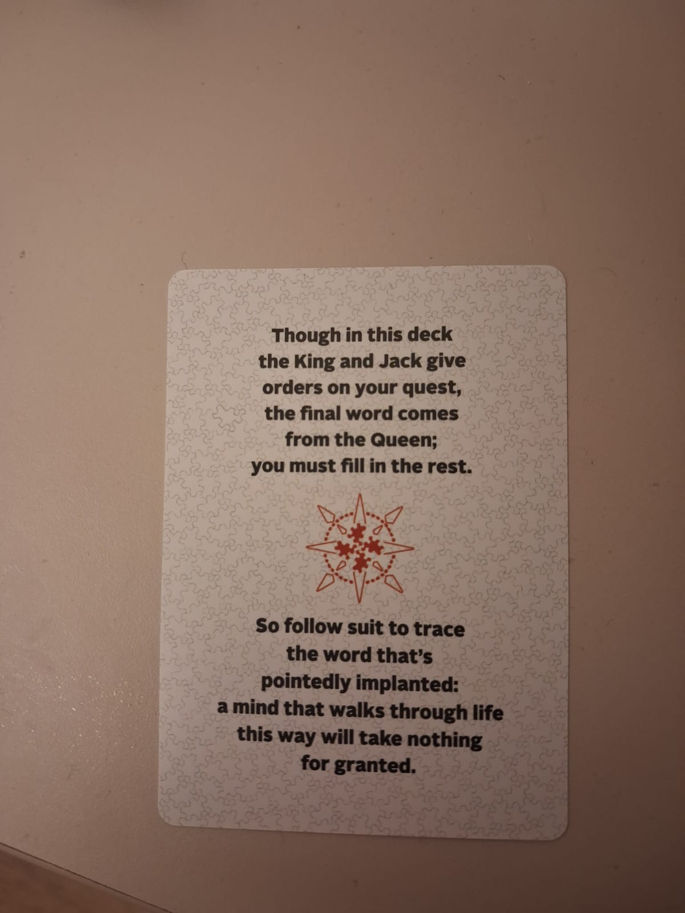

>> A bit of a tangent: when I opened the deck the cards where not in the correct order. When I saw the last card being a bit too meticulous for my own good I quickly wrote down the order the cards were in. It didn't come up in the solution and it would be a bit weird if such volatile information would be important, but I still have it saved just in case.

Jane Street are known for their puzzles, They even have a page on their website dedicated to puzzles. It didn't take much to sense that a cryptic message is the puzzle statement, but at this point I was still not sure. I often see patterns in places when it wouldn't make sense, but this one was different. 

Here are all of the other cards laid out and a few relevant to the additional card pictured a bit closer:

    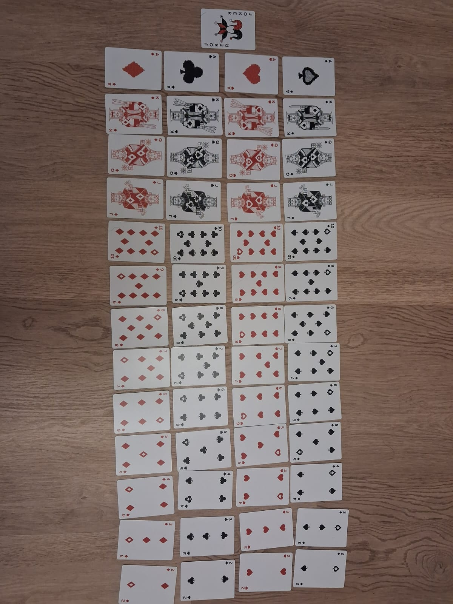

    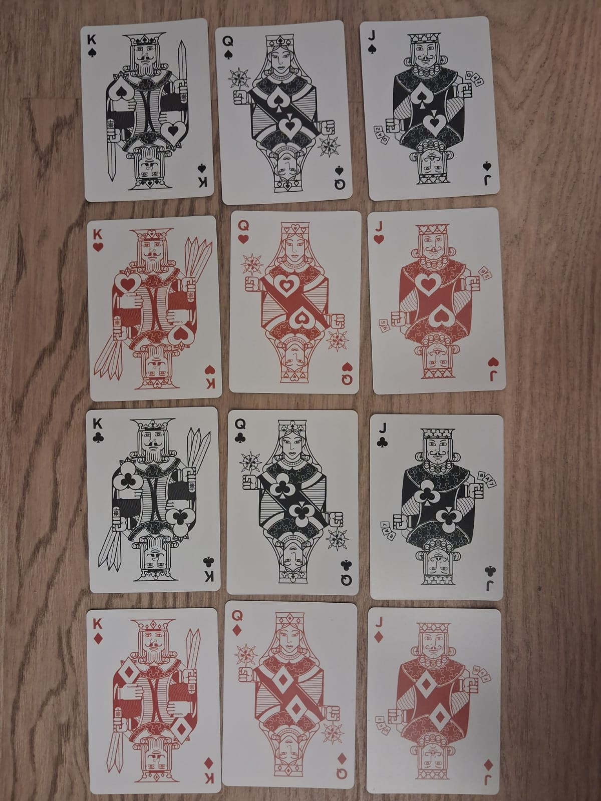
    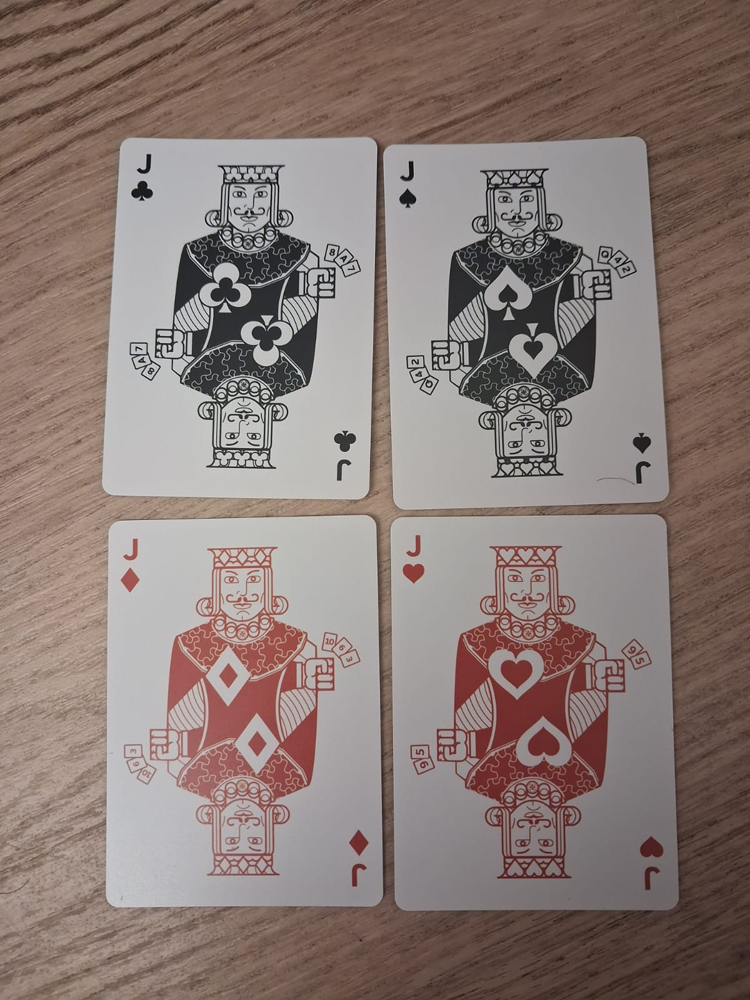

>> don't mind my floor, when I was rushing to solve the puzzle I didn't have time to clean my desk, or brashness to swipe everything off of it like they do in the movies.

And here is the additional card text for convenience:

> Though in this deck the King and Jack give orders on your quest, the final word comes from the Queen; you must fill in the rest.
>  
>  
> So follow suit to trace the word that's pointedly implanted: a mind that walks through life this way will take nothing for granted.

 

**<ins>Disclaimer</ins>: in this write-up I will completely spoil the solution, the information above is sufficient to solve the puzzle. It doesn't require any technical knowledge and is pretty fun.**

## First half

First we of course have to look at the Kings and Jacks in the deck, that's where the puzzle points us to.

    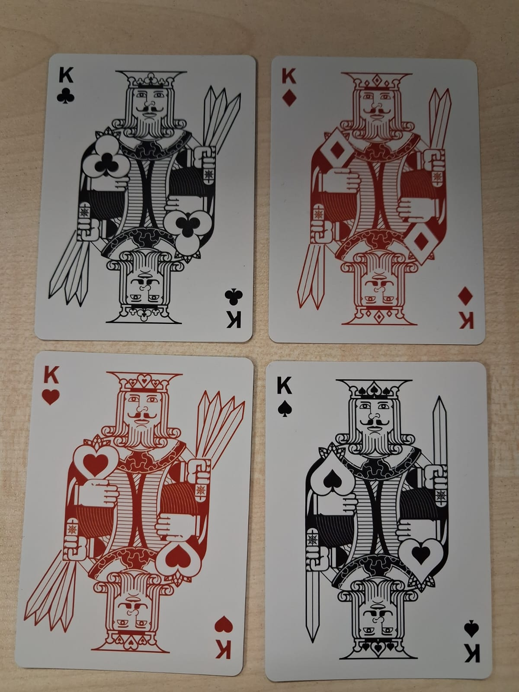
    

You can see that the kings all have different number of swords. That's when I was sure that's not just a cryptic message. And now "King give orders" makes sense, there are 4 kings that are ordered, and they give the order of the suits:

### Spades, Diamonds, Clubs and Hearts.

As for the Jacks, after quick comparison you can see that they are slightly different. Each is holding a few presumably cards with numbers and letters. Kings gave the order of the suits, it would make sense if Jacks gave the order of the ranks.

If you arrange the Jacks in the correct suit order and read the cards in their hands from left to right you get:

### Queen, 4, 2, 10, 6, 3, 8, Ace, 7, 9, 5.

Next part of the puzzle states "the final word comes from the Queen", I interpreted it as the final word starts with with the queen, so the order we got in the last step will reveal the word.

## Second half

The first idea is to lay down all the cards in the ranks order and see if you can find anything weird, and it's easy to see something odd at this point:

    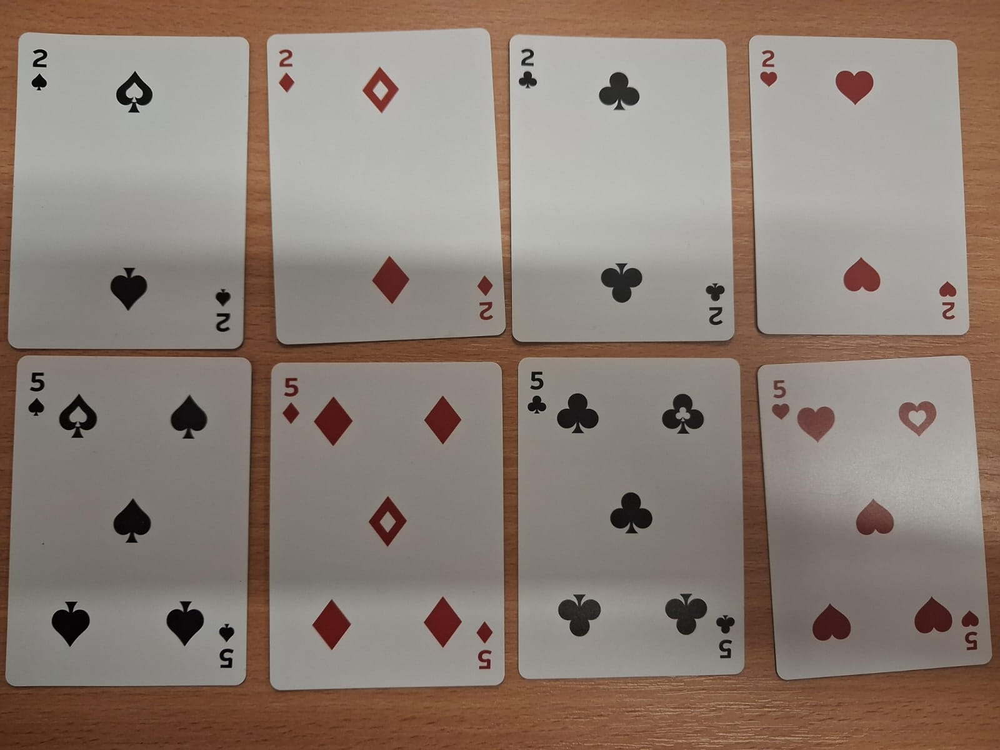

Some, but not all, cards have strange holes in their suits. For example there are only 2 holes in 2's, and both of them are at the top in the picture. But you can rotate cards, and every card either has one or none holes, meaning the information is encoded in their place, or as binary in the order of suits. To test placement idea we flip around the cards to find a very helpful guide:

    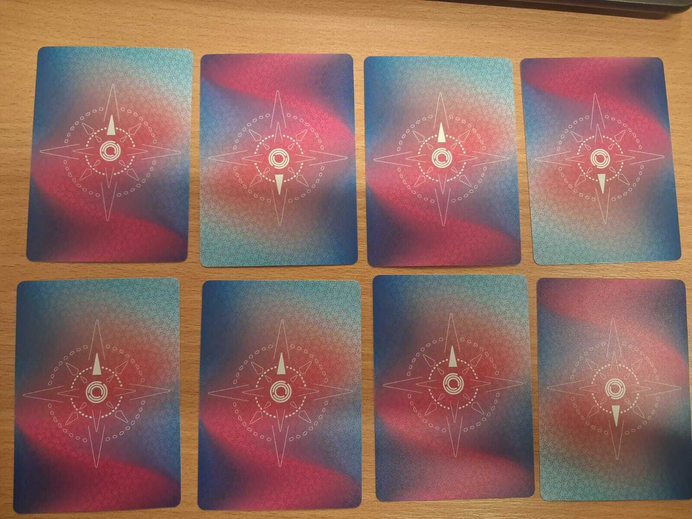

Every card has a clearly defined upright direction. So we orient every card up to see if we can find any pattern in their placements. Now we know that the information we need is in the positions of these holes, meaning the cards without holes are probably irrelevant.

Finding a hole in numbered cards is easy, but in the ranks order we have a Queen and an Ace. It's not hard once you know it's there but it's easy to shrug it off before you start the puzzle as a design choice:

    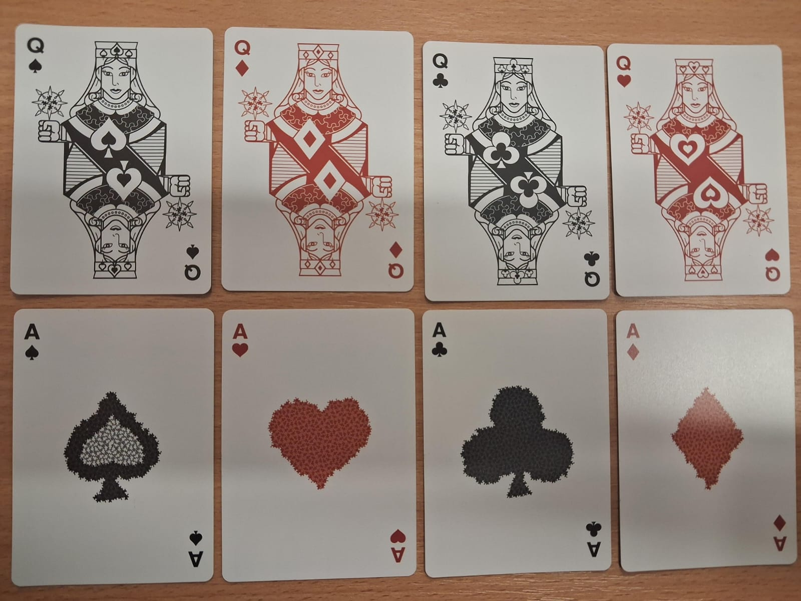

>> No joke I screamed when I found a hole in the Queen of Hearts. It took me out like a jumpscare. That was the exact moment I realised that I randomly stumbled into a really good puzzle.

Now we will need the next part of the puzzle statement: "So follow the suit to trace the word ...". It's pointing us to the fact that it's not enough to order the cards using their ranks, we need to use the suit order again. So we just arrange all of the cards with holes in the ranks order and then in the suits order and see if we can make sense of it.

    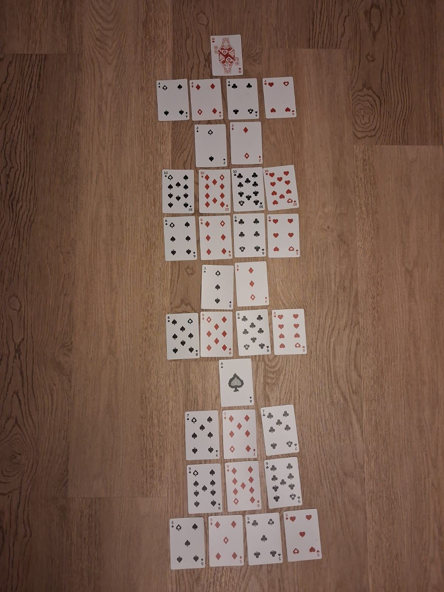

From the cards laid out we can see that a lot of the ranks have holes in all 4 cards. Also most of the holes are in the corners excluding Queen, Ace and 5. For example 4, 10, 6 and 8 have holes in all 4 corners, but they are in a different order. For 4 it is _top-left, bottom-left, bottom-right, top-right_, for 10 and 6 it is _top-left, top-right, bottom-left, bottom-right_ and for 8 it is _top-right, top-left, bottom-left, bottom-right_. If we look again at the last part of the statement we can see that the word "trace" seems to be deliberate. It is pointing towards tracing the letters using the positions of the holes. 4 is U, 10 and 6 are Z and 8 is C.

From here it is pretty easy to fill out the final word, assuming Queen stands for Q and Ace for A we get the word:

# Quizzically
## "A mind that walks through life that way will take nothing for granted."

**Conclusion:** Some might say that one rarely finds puzzles in the wild outside of places where puzzles are shared. I would disagree. When you are in the right mindset (one might even say in a "quizzical mindset") puzzles find you. Most of them don't have clear correct solutions, so it's always a pleasure to encounter a puzzle crafted by hand. Great thank you to Jane Street for encouraging interest in puzzles among people and have a quizzical rest of the day.

>> **P.S.:** After solving the puzzle I tried searching it up, but I didn't find anything relating to it. My teammate told me that Jane Street cards weren't the same last time, so it's probably a pretty new puzzle, but considering how it's a lot easier then usual Jane Street puzzles and doesn't require any prior knowledge maybe no one bothered to write down the solution anywhere. I think a solution should exist online (I didn't find anywhere on the deck that the solution should not be shared).

>> **P.P.S.:** While developing this write-up I found out that (on the most obvious place one should look at first actually) at the back of the puzzle statement card there is a QR code that links to the [page](https://www.janestreet.com/puzzles/playing-cards/) where you can submit the solution and see some hints. Here we can verify the result:

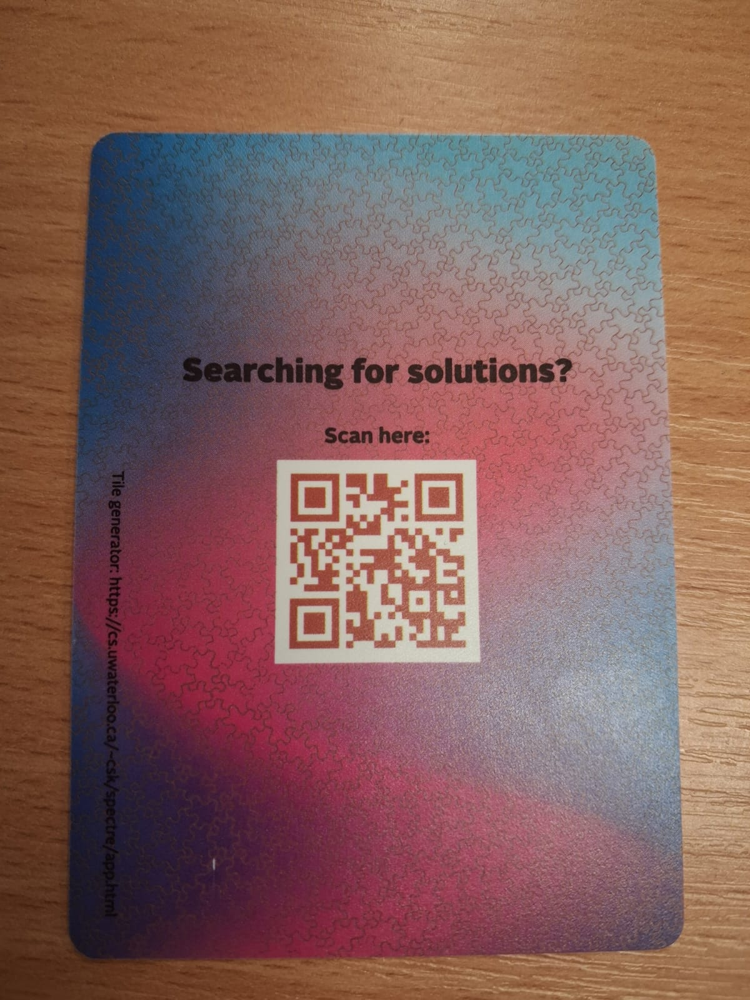

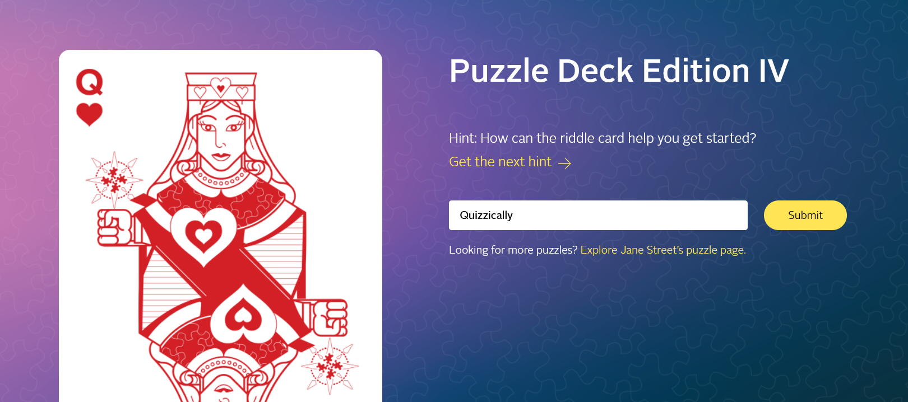

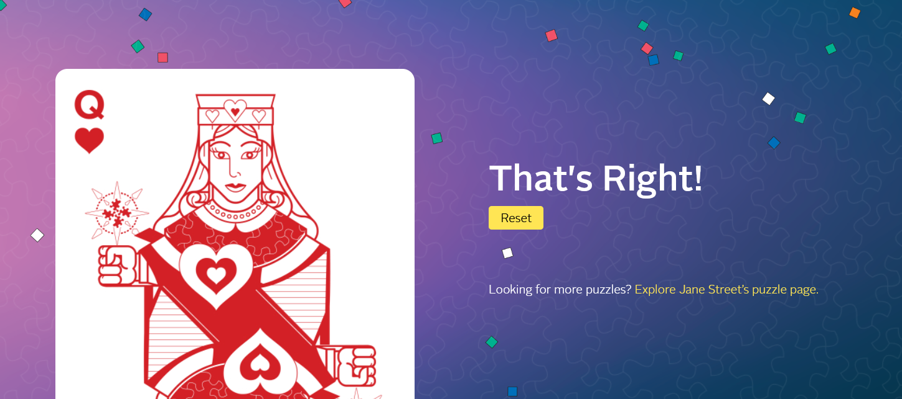

